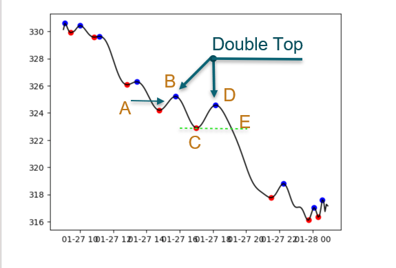
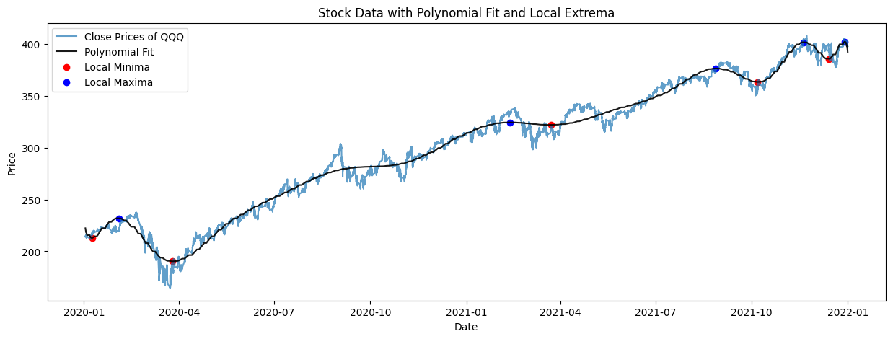

# Double Trouble: Pattern Detector

## Objectives
Our goal is to develop and establish an experimental trading algorithm that identifies short and long position entries, via, trend reversal patterns within daily stock data of 'Invesco QQQ Trust Series 1 (QQQ)'. We will be identifying the two patterns commonly referred to as double tops and double bottoms, which once identified will trigger a buy or sell signal for the algorithm. We then intend to train and test our algorithm in various machine-learning models to select and implement the most efficient machine-learning model for our algorithm.  

## Requirements
 - Python Dependencies
    - [alpaca-trade-api]
        - To install alpaca api: `pip install alpaca-api`
        - Create an account at [Alpaca](https://alpaca.markets/)
        - Create a [Alpaca api key](https://docs.alpaca.markets/docs/getting-started-with-trading-api)
        - Add the Alpaca api key to your .env with the format `ALPACA_API_KEY ={ALPACA_API_KEY}` & `ALPACA_SECRET_KEY ={ALPACA_SECRET_KEY}`

## Our Process

### 1.Pattern Identification
Double top/bottom patterns are technical reversal patterns that form after an asset reaches a high/low price two consecutive times with a moderate decline/incline between the two high/lows.

These patterns are not always easy to spot because there needs to be confirmation with break below support.

Key Elements of a Double Top/Bottom:
- Up/down-trend: price should be moving in an up or down direction.
- Valley for double top pattern, or peak for double bottom pattern.
- Neckline break: horizontal line that is created at the respective.
- Break of Neckline: price drop below/above horizontal neckline. Initiate trigger. 

An example of a double top signal would look something like the following:

### 2.Polynomial Smoothing
Polynomial fitting involves using a polynomial equation to approximate a relationship between variables. In our stock data scenario, the polynomial smoothing process was implemented to model and understand the relationship between the stock's historical prices and time. When undergoing the polynomial fitting process a polynomial degree must be selected, we ultimately decided that a polynomial degree of 25 worked best for the two years of 5-minute stock data in our algorithm. The process of fitting polynomials to stock data involves adjusting the coefficients within the equation to minimize differences in a stock's price, at any given time, and the predicted values. This will, in theory, help identify trends and cycles within our dataset.

### 3. Locating Local Min/Max Extrems to Establish Entry Targets
Once the polynomial fitting process was complete new columns were created within the original dataframe to include polynomial values for the open, high, low, and close of our selected stock data. We then utilized the `argrelextrema` function from the SciPy library to iterate through the polynomial data and select both the local minima and maxima within the fitted data. Once a minima or maxima was identified, logic was used to pinpoint the double-top and double-bottom patterns by selecting any 5, time-dependent, datapoints and issuing them values of a, b, c, d, and e. This then allowed us to set a new column, acting as a trigger for a long entry point on the identified double bottom pattern and a short entry point on the identified double top patterns. This trigger column was selected as the target data for our machine-learning models. 

Double Top Logic:
- a < b 
- a < d
- c < b
- c < d
- e < b
- e < d
- b > d

Double Bottom Logic:
- a > b 
- a > d
- c > b
- c > d
- e > b
- e > d
- b < d

## Inital Model Selection and Testing

### First Model: Logistic Regression
Logistic regression is a fundamental statistical and machine learning model used for predicting a continuous target variable based on one or more input features. It assumes a linear relationship between the inputs and the target variable, which means that the relationship can be represented by a straight line in a scatterplot.

Using GridSearchCV, we ran multiple Logistic Regression models using ‘linlinear’, ‘saga’, and ‘lbfgs’ solver algorithms with various regularization parameters ( C ), with values of 0.1,1.0, and 10.0.

The most optimized and final logistic regression model selected was: LogisticRegression (C = 10.0, solver = ‘saga’)
 - Accuracy: 0.8333333333333334
 - Precision: 0.8104575163398693 
 - Recall: 0.8551724137931035
 - F1 Score: 0.8322147651006712 
 - Confusion Matrix: True Positive = 126; False Negative = 21; False Positive = 29; True Negative = 124.

### Second Model: Polynomial Regression
A form of regression analysis where the relationship between our independent (X_train, X_test) and dependent variables (y_train, y_test) are modeled as nth-degree polynomials in x. Though the polynomial regression fits a nonlinear model to the data, it is statistically a linear problem. This is addressed by fitting linearly to every x at the corresponding y.

Testing through various model parameter combinations and with only a 2nd-degree polynomial to avoid overfitting.

- Accuracy: 99.69% → Important, but feels as if the model may be overfitting
- Precision: 87.65% → Identifies target class fairly well. This feels in line and not overfitting
- Recall: 47.65% → Potential high number of false negatives.
- F1 Score: 61.74% → Approaching the 70% score that is considered “good”.

The model was trained and tested with all targets being assumed to be one (1) - this is independent of a long or short position (double bottom or double top). This is done assuming that the user will have some experience in day trading and will use the model to assist with trade conviction and identification.

### Third Model: Support Vector Machine
A Support Vector Machine (also known as SVM) is a machine learning algorithm used for classification and regression tasks. It is known for its effectiveness in finding decision boundaries that separate different classes or predictive numerical models.

Final Model: 
- Accuracy: 0.8326731613317632
- Precision: 0.0
- F1: 0.0
- Recall: 0.0

Reasoning behind scores: The most significant factor contributing to this is most likely a class imbalance in the data. With an SVM, especially with a linear kernel, it is very sensitive to imbalance datasets. In such cases, classifiers tend to be biased towards the majority class (class 0) and may perform poorly on the minority class (class 1) because they prioritize overall accuracy.

## Benchmark & Champion Model's

### Benchmark: Support Vector Machine
Due to the experimental nature of our objective, coupled with the very narrowed scope of the issue, our research failed to locate any solid benchmarks to gauge against the results of our final three models. For this reason, we have chosen to select our final support vector machine (SVM) as the benchmark for our final results. Reasoning behind the SVM model being selected as the benchmark is that the results were inconclusive, due to suspected overfitting or class imbalances within the model's data.  
Final Model: 
- Accuracy: 0.8326731613317632
- Precision: 0.0
- F1: 0.0
- Recall: 0.0

### Champion Model: Logistic Regression
After compiling each of our final three models from the testing results, we determined that the most efficient model for our experiment was LogisticRegression (C = 10.0, solver = ‘saga’). This model seemed to succumb the least to possible overfitting as the results across the board were logical while also being high-performing, not visibly showing any outlier results.  
 - Accuracy: 0.8333333333333334
 - Precision: 0.8104575163398693 
 - Recall: 0.8551724137931035
 - F1 Score: 0.8322147651006712 
 - Confusion Matrix: True Positive = 126; False Negative = 21; False Positive = 29; True Negative = 124.

## Experiment Conditionals
1. Five (5) minute stock market data was used and days were grouped for training and testing purposes. Day trading common practices are to utilize the 5 min data to identify patterns and trends. Day traders also typically treat and apply single-day trading vs multi-day positions slightly differently as risk involves adjusting with overnight holding.
2. Post-COVID market conditions. We were in thought that COVID and the events following influenced the retail trader and made available information and data that was not necessarily utilized by all. Also from personal experience.
3. Used two (2) to three (3) years of data in our analysis.
4. Reviewed only the QQQ security (reflects tech-heavy Nasdaq). We believe that the volatility within this index allows for more frequent trend reversals and potential profits. This is not without its own inherent risk.
5. Target audience: Day Traders. The concept behind this experiment would have the model actively monitor live data the within script of trading platforms (e.g. Think or Swim (TOS)). As a pattern is predicted and identified by the signal would be identified on the chart and the user can choose to take the trade or not, user personal variables. At this point, the user would have full control of the way they manage the trade. Complete automation was considered and can still be implemented with further investigation and coding, but there is some concern about liability and the complete release of personal funds.

## What's Next?
1. Do we keep only one security or test amongst others? Double tops and bottoms present themselves in almost all tradeable assets, and the definition of a double top does not change.
2. Do we automate even more? please reference "Experiment Conditionals?" part 5.
3. Do we review a larger data set? Additional time frames?
4. How to implement this on an active paper trading account?
5. Work to implement additional patterns within this model. Or independent new models for other patterns?